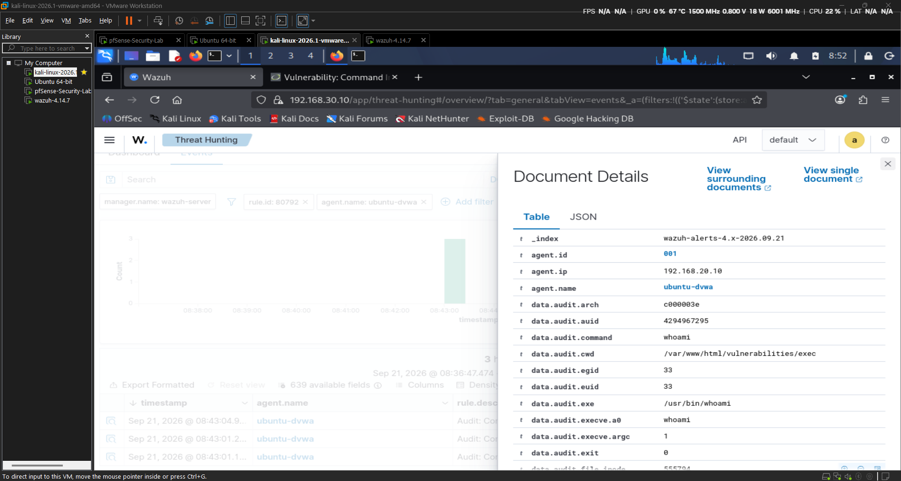
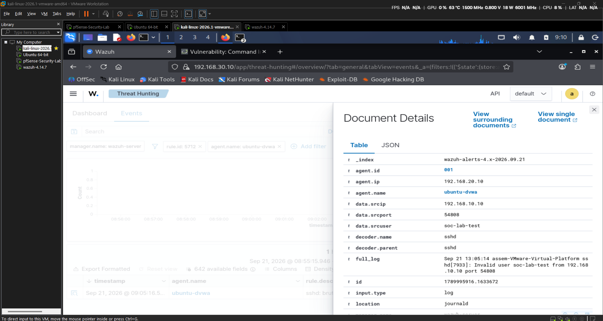
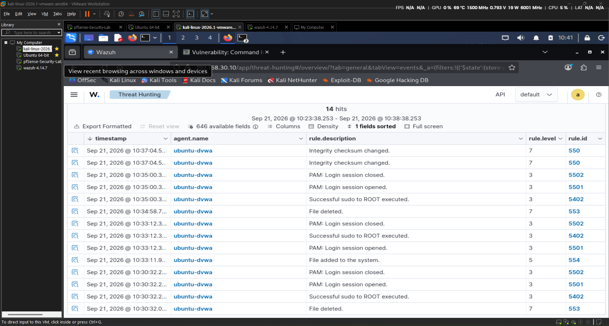
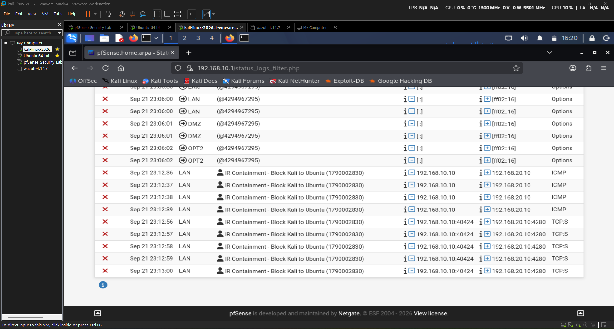
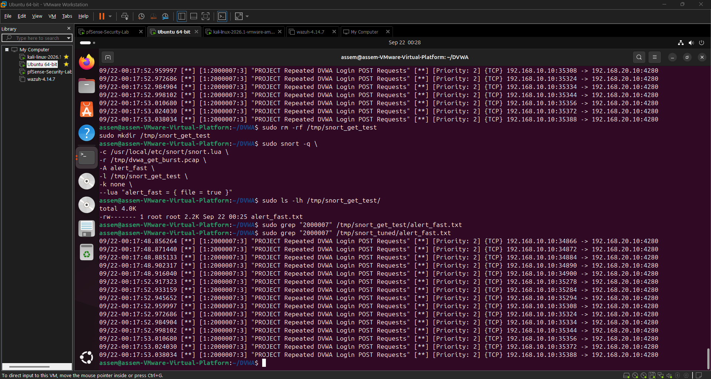
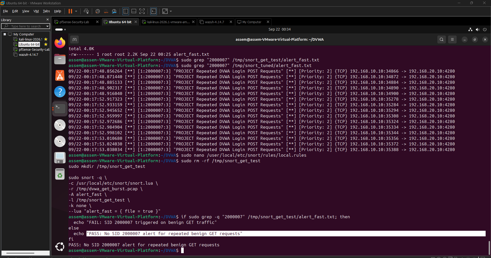
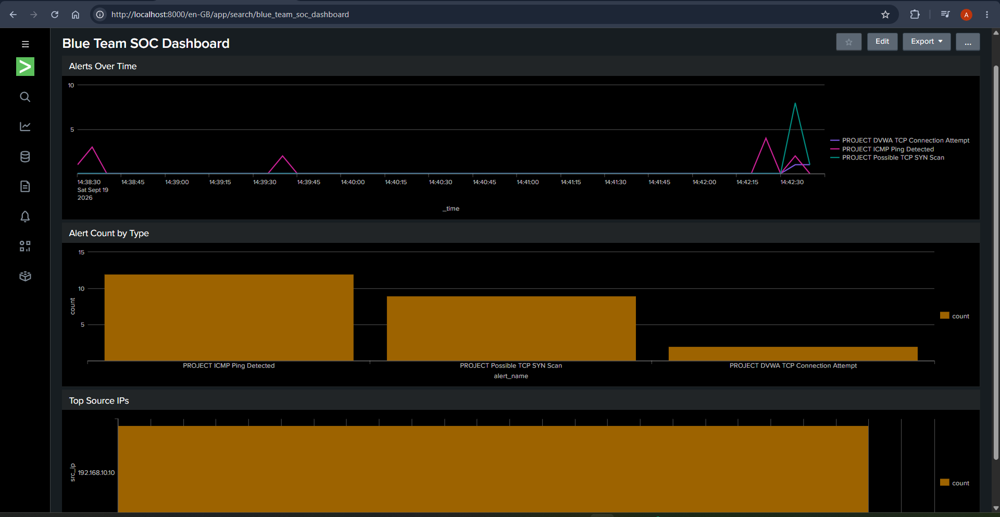

<div align="center">

# Enterprise Network Defense & SOC Incident Response Lab

**Blue Team / SOC Portfolio Case Study · Assem**

Detection · Investigation · Correlation · Containment · Recovery · Tuning

[Full report (PDF)](reports/Enterprise_Network_Defense_SOC_Incident_Response_Lab_Report_Cover_Refined.pdf) · [Investigation highlights](#investigation-highlights) · [Detection tuning](#detection-tuning)

</div>

I built a segmented VMware lab to practice the SOC workflow from suspicious traffic to confirmed endpoint activity and incident response. Controlled tests against Dockerized DVWA connected network detection, packet analysis, SIEM investigation, and Linux endpoint monitoring.

> **Key result:** Correlated a Snort command-injection alert with Auditd/Wazuh process evidence to validate command execution, then demonstrated targeted containment, recovery, and detection tuning.

## Architecture

| Zone | System | Host address | pfSense gateway |
| --- | --- | --- | --- |
| LAN | Kali Linux — controlled attacker | `192.168.10.10` | `192.168.10.1` |
| DMZ | Ubuntu Server / Docker / DVWA | `192.168.20.10` | `192.168.20.1` |
| SOC | Wazuh server | `192.168.30.10` | `192.168.30.254` |

pfSense provided routing and stateful filtering between the zones, with a VMware NAT uplink at `192.168.221.132/24`. DVWA used TCP port `4280`. The Ubuntu target also ran Snort 3, Auditd, and the Wazuh agent.

## Security Controls

| Tool | Work completed |
| --- | --- |
| **pfSense** | Network segmentation, firewall policy, targeted containment |
| **Snort 3** | Custom IDS rules for network activity and web-attack indicators |
| **Wireshark** | Packet validation of scans, SQL injection, command injection, and DNS |
| **Splunk Enterprise** | Snort log ingestion, SPL field extraction, source analysis, timelines, and dashboards |
| **Wazuh + Auditd** | Linux `execve` telemetry, SSH authentication monitoring, and file integrity monitoring |

## Investigation Highlights

### Command injection: network-to-endpoint correlation

Kali sent a controlled command-injection request to `192.168.20.10:4280`. Snort **SID `2000005`, rev `2`** flagged the `whoami` payload in the historical incident record.

Auditd recorded `/usr/bin/dash`, `/usr/bin/ping`, and `/usr/bin/whoami` under **`www-data`**. Wazuh surfaced the execution telemetry through **rule `80792`**. Matching the request context with endpoint process evidence supported confirmed command execution; the network alert alone did not establish success.



*Endpoint evidence: `/usr/bin/whoami`, EUID `33` (`www-data`), and the DVWA application path.*

### Authentication and file integrity monitoring

| Scenario | Observed result |
| --- | --- |
| **SSH password guessing** | Repeated invalid logins for the nonexistent test username `soc-lab-test` triggered Wazuh **rule `5712`**. No account was compromised. |
| **Cron persistence simulation** | A harmless file under `/etc/cron.d/` generated FIM events: **`554`** (added), **`550`** (modified), and **`553`** (deleted). This demonstrated file-change monitoring, not malware deployment. |

<details>
<summary>View SSH and file integrity evidence</summary>





</details>

## Containment and Recovery

A targeted pfSense rule blocked `192.168.10.10` from `192.168.20.10`. It was placed on the **LAN ingress interface**, above the broad allow rule.

ICMP, SSH, and DVWA HTTP checks failed after containment. Firewall logs confirmed blocking on the intended path. Disabling the containment rule and repeating the checks verified restored connectivity.

<details>
<summary>View pfSense containment evidence</summary>



</details>

## Detection Tuning

The broad repeated-request detection was refined into **SID `2000007`, rev `3`**, matching HTTP **`POST`** requests to **`/login.php`** with this per-source filter:

```text
detection_filter:track by_src,count 5,seconds 30;
```

| Validation traffic | Observed result |
| --- | --- |
| 10 benign `GET /login.php` requests | No SID `2000007` alert |
| Repeated `POST /login.php` requests | Multiple SID `2000007` rev `3` alerts |

This addressed the observed benign GET match while retaining the intended POST detection. Packet capture and offline Snort replay also helped validate signature logic during live-inspection troubleshooting.

<details>
<summary>View POST detection and benign GET validation</summary>





</details>

## Splunk Investigation

Snort events were ingested into Splunk for alert counts, source-IP pivots, and timeline analysis using SPL. The selected dashboard view below shows ICMP, SYN-scan, and DVWA connection alerts; additional web-attack findings are documented in the report.

<details>
<summary>View the Splunk SOC dashboard</summary>



</details>

## MITRE ATT&CK Mapping

| Technique | Supporting lab behavior |
| --- | --- |
| **T1059.004 — Unix Shell** | Shell and utility execution in the command-injection case |
| **T1110.001 — Password Guessing** | Repeated failed SSH authentication |
| **T1053.003 — Cron** | Controlled file lifecycle under `/etc/cron.d/` |
| **T1190 — Exploit Public-Facing Application** | Conceptual mapping for the DVWA exploitation scenario |

T1190 is conceptual: DVWA was isolated in the lab DMZ and was **not Internet-facing**.

## Project Evidence

| Resource | Contents |
| --- | --- |
| [Full project report](reports/Enterprise_Network_Defense_SOC_Incident_Response_Lab_Report_Cover_Refined.pdf) | 29 pages covering architecture, rule logic, incident timelines, response verification, and troubleshooting |
| [Screenshots](screenshots/) | Selected evidence grouped by monitoring tool, incident response, and detection tuning |

**Skills demonstrated:** Alert triage · Packet analysis · SPL investigation · Linux endpoint monitoring · Evidence correlation · Firewall response · Detection engineering · Technical documentation

**Lab scope:** An enterprise-style training environment. All attack simulations targeted owner-controlled local systems.
